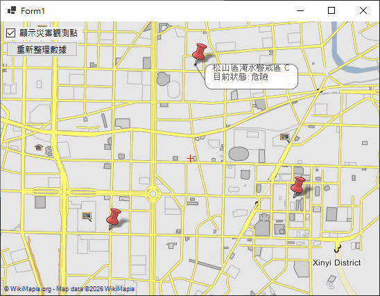
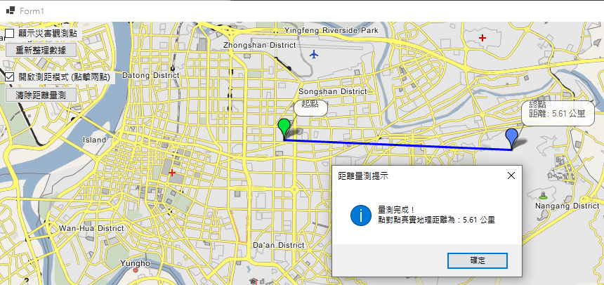
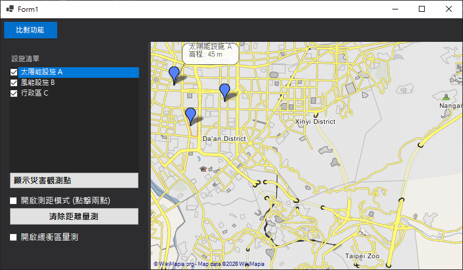
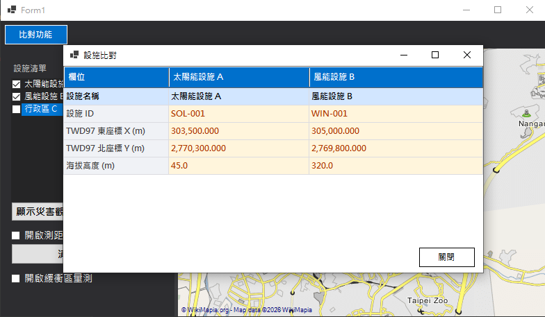

# Highly Extensible GIS Architecture Proof-of-Concept (PoC)

### WinForms .NET 8 | GMap.NET | Spatial Geometry | Service-Oriented Architecture

A modular desktop GIS application built with **WinForms (.NET 8)** and **GMap.NET**, demonstrating scalable geospatial architecture, geodesic spatial computation, and maintainable desktop engineering practices.

This project explores how to combine:

* GIS visualization
* Spatial mathematics
* Service-Oriented Architecture (SOA)
* Event-driven UI systems
* Decoupled desktop application engineering

while avoiding common WinForms maintainability issues such as monolithic `Form1.cs` implementations and tightly coupled rendering logic.

---

# 📸 Screenshots

## Disaster Warning Pins



## Distance Measurement



## Facility List



## Facility Compare



---

# 🚀 Key Features & Highlights

* **Decoupled Architecture**
  Transitioned from monolithic WinForms event handling into a clean Service-Oriented Architecture.

* **Geodesic Distance Measurement**
  Real-time point-to-point geographical measurement using the Haversine Formula.

* **Dynamic Buffer Analysis Polygon**
  Geodesic buffer circle generation around map nodes using localized spatial projection logic.

* **State-Isolated UI & Gesture Handling**
  Eliminates mouse interaction conflicts between map dragging and geometry drawing.

* **Adaptive Sidebar Layout**
  Runtime-generated layout management without fragile Visual Studio Designer dependencies.

---

# 🧰 Technologies

* C#
* .NET 8
* WinForms
* GMap.NET
* GIS / Geospatial Systems
* Spatial Geometry
* Haversine Formula
* Service-Oriented Architecture (SOA)
* Desktop Application Engineering

---

# ⚡ Quick Start

## Requirements

* Windows 10 / 11
* .NET 8 SDK
* Visual Studio 2022 or VS Code

---

## Clone Repository

```bash
git clone https://github.com/CharlesWilliamW/GisPoc.git
cd GisPoc
```

---

## Open with Visual Studio 2022

1. Open `GisWinFormsNet8App.sln`
2. Restore NuGet packages automatically
3. Set the startup project if necessary
4. Press `F5` to run

---

## Open with VS Code

### Recommended Extensions

* C# Dev Kit
* .NET Install Tool
* NuGet Package Manager

### Restore Packages

```bash
dotnet restore
```

### Build Project

```bash
dotnet build
```

### Run Project

```bash
dotnet run
```

---

# 🏗️ Software Engineering & Architecture

## Separation of Concerns (SoC)

Traditional WinForms applications often accumulate business logic, rendering code, and API communication inside `Form1.cs`.

This project minimizes code-behind coupling by isolating rendering, geometry, and data workflows into dedicated services.

### Core Services

* `MapDataService`
  Handles data models and asynchronous API communication.

* `DisasterOverlayManager`
  Controls marker lifecycle, overlays, and map rendering behavior.

* `MapMeasurementService`
  Encapsulates geometry calculations and measurement rendering logic.

---

## Input Conflict Resolution via Event Interception

Professional GIS systems require smooth coexistence between:

* Left-click drawing
* Left-click dragging (map pan)

This project resolves overlapping mouse state conflicts through a lightweight event interception strategy, ensuring reliable interaction handling without Designer-generated event corruption.

---

# 📐 Mathematical & Spatial Mechanics

The geometry system intentionally focuses on lightweight computational approaches instead of depending on heavyweight GIS engines, enabling architectural clarity and fine-grained control over spatial behavior.

---

## Great-Circle Distance (Haversine Formula)

To measure true geographical distance across Earth's curved surface, the project implements the Haversine Formula instead of flat Cartesian approximation.

$$\Delta lat = lat_2 - lat_1$$

$$\Delta lon = lon_2 - lon_1$$

$$a = \sin^2\left(\frac{\Delta lat}{2}\right) + \cos(lat_1) \cdot \cos(lat_2) \cdot \sin^2\left(\frac{\Delta lon}{2}\right)$$

$$c = 2 \cdot \text{atan2}\left(\sqrt{a}, \sqrt{1-a}\right)$$

$$d = R \cdot c$$

Where:

* (R) = Earth's mean radius (~6,371,000 meters)

---

## Geodesic Buffer Analysis

To generate accurate circular buffer zones on Mercator projection maps, the project computes localized spherical coordinate offsets before rendering polygon overlays.

$$\Delta Lat = \frac{\text{Radius}}{6,371,000} \times \frac{180}{\pi}$$

$$\Delta Lng = \frac{\text{Radius}}{6,371,000 \times \cos\left(Lat_{\text{center}} \times \frac{\pi}{180}\right)} \times \frac{180}{\pi}$$

---

# 📂 Project Structure

```text
GisWinFormsNet8App/
│
├── Services/
│   ├── MapDataService.cs
│   ├── MapMeasurementService.cs
│   └── DisasterOverlayManager.cs
│
├── Models/
│   └── DisasterPoint.cs
│
├── Form1.cs
└── Program.cs
```

---

# 🚧 Future Improvements

* Real-time government API integration
* Layer grouping & filtering
* Offline tile caching

---

# 📄 License

MIT License
